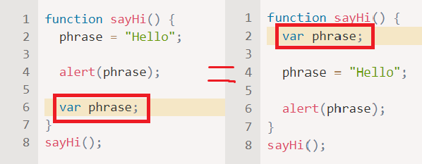
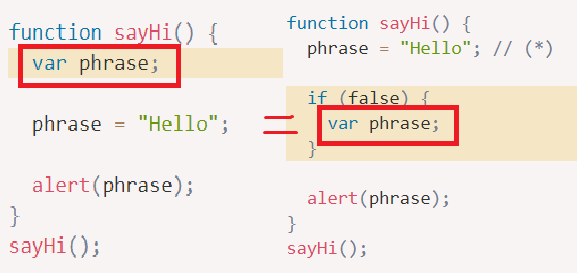

April 20, Friday  


## **var** vs **let** vs **const**
### var
---
> 블록 스코프가 없다.  

즉, 함수 스코프이거나 전역 스코프이다.
블록 기준으로 스코프가 생기지 않아 블록 밖에서도 접근이 가능하게 된다.

```javascript
// Example

if (true) {
  var test = true;  // 'let' 대신 'var'를 사용
}

alert(test); // true(if 문이 끝났어도 변수에 여전히 접근할 수 있음) 즉, test는 전역 변수
---------------------
for (var i = 0; i < 10; i++) {
  // ...
}

alert(i); // 10, 반복문이 종료되었지만 'i'는 전역 변수이므로 여전히 접근 가능합니다.
---------------------
function sayHi() {
  if (true) {
    var phrase = "Hello";
  }

  alert(phrase); // 제대로 출력됩니다. 즉, phrase는 함수 레벨 변수
}

sayHi();
alert(phrase); // Error: phrase is not defined
```

위와 같이 var는 if, for 등의 코드 블록을 관통한다.

---
> 같은 변수를 재선언 할 수 있다.

```javascript
// Example

// 같은 스코프에 같은 변수를 let으로 재선언했다면 에러가 뜬다.
let user;
let user; // SyntaxError: 'user' has already been declared

// 하지만 var를 이용하면 몇 번이고 재선언이 가능하다.
// 재선언된 변수와 같은 변수가 이미 선언되었다면 그 변수는 무시된다.
var user = "Pete";
var user = "John"; // this "var" does nothing (already declared)
// ...it doesn't trigger an error

alert(user); // John
```

---

> 선언하기 전에 사용할 수 있다.

전역에서 선언한 변수라면 스크립트가 시작될 때, 함수에서 선언한 변수라면 함수가 시작될 때 처리된다.

Example 01

Example 02


위의 두 예제모두 동일하게 작동되는 모습이다.
이렇게 변수가 끌어올려 지는 현상을 **호이스팅(hoisting)** 이라고 부른다.

Example 02에서 if(false) 블록 안 코드는 절대 실행되지 않지만, 이는 호이스팅에 전혀 영향을 주지 않는다.  
즉, if 내부의 var는 sayHi()의 시작부분에서 처리되므로 (*)표시된 줄에 이미 phrase는 선언된 상태라는 것이다.

---
## 호이스팅(hoisting)
> 선언은 호이스팅 되지만 할당은 호이스팅 되지 않는다.


```javascript
// Example

function sayHi() {
  alert(phrase);

  var phrase = "Hello";
  // 1. var phrase (변수 선언)
  // 2. phrase = "Hello" (변수에 값 할당)
}

sayHi();

// 위의 sayHi 함수를 동작 순서에 맞게 코드를 작성해보면
function sayHi() {
  var phrase; // 선언은 함수 시작 시 처리

  alert(phrase); // undefined

  phrase = "Hello"; // 할당은 실행 흐름이 해당 코드에 도달했을 때 처리
}

sayHi();
```